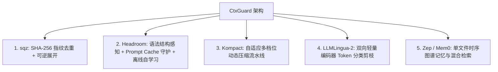
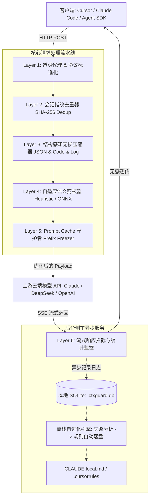

# CtxGuard：超轻量级 LLM 上下文优化与智能守护网关设计方案

> **项目名称**：`CtxGuard`（Context Guard —— 上下文守护者）  
> **核心使命**：以极致轻量（0 重型依赖、单文件免运维、<3ms 网关开销）的架构，融合业界顶尖技术（Headroom + sqz + Kompact + LLMLingua-2 + Zep/Mem0），为 AI Agent 提供 50%~80% 的 Token 成本削减、无损可逆压缩、Prompt Cache 守护与离线自进化能力。

---

## 一、 项目背景与核心痛点

在 Coding Agent、多轮对话、自动化工作流等 Agent 场景中，Token 消耗呈指数级膨胀：

1. **重复读取与文件冗余**：Agent 频繁读取同一个代码文件或工具输出，每轮对话重复发送数万 Token（占总开销 60% 以上）。
2. **工具输出结构膨胀**：数据库查询、日志、JSON 返回包含大量重复的 Key、null 字段、格式空白以及无意义的 ANSI 颜色码。
3. **破坏厂商 Prompt Cache**：传统压缩工具乱改历史消息或前缀，导致无法命中 Anthropic / DeepSeek / OpenAI 的官方 Prompt Caching（白白损失 50%~90% 的官方缓存折扣）。
4. **现有开源方案的两极分化**：
   - *重型方案*：动辄引入 PyTorch、Docker、Milvus、Redis，部署复杂、启动慢、内存占用几个 G；
   - *简易方案*：单纯暴力截断文本，破坏代码/JSON 语法，导致模型报错或幻觉。

---

## 二、 行业顶级项目长处融合矩阵

本项目深度吸收并融合了业内最强项目的核心杀手锏：



| 借鉴项目              | 核心吸收的技术亮点                                                           | 在 CtxGuard 中的具体实现                                                            |
| :---------------- | :------------------------------------------------------------------ | :--------------------------------------------------------------------------- |
| **`sqz`**         | • SHA-256 内容指纹去重<br>• `sqz_expand` 可逆按需展开<br>• Safe-mode 保护报错与堆栈    | **会话级内容指纹缓存**：重复内容转为 `~10 Token` 哈希指针；向大模型自动注入 `ctx_expand` Tool 实现 100% 可逆。 |
| **`Headroom`**    | • JSON 数组先试无损、省不够才丢<br>• 静态前缀严格冻结（Cache-Safe）<br>• `learn` 失败因果反思落盘 | **结构化语义压缩器**：剥离 JSON 冗余 Key；严格保卫 System Prompt 字节级一致性；离线挖掘死循环并更新规则。          |
| **`Kompact`**     | • 多档位自适应流水线（Adaptive Pipeline）                                      | **动态策略调度**：短上下文走轻量无损清洗，超长上下文自动升级为深度结构折叠。                                     |
| **`LLMLingua-2`** | • 丢弃慢速生成式因果模型，改用微型双向编码器快速打分丢词                                       | **可选 ONNX INT8 文本剪枝插件**（按需加载，仅 30MB），毫秒级完成万字文档的高密度浓缩。                        |
| **`Zep / Mem0`**  | • 时序记忆提取与实体关系演化                                                     | **SQLite + FTS5 + 2 跳关系图**：零运维单文件数据库，存储长期实体与偏好。                              |

---

## 三、 极致轻量化设计原则（Ultra-Lightweight Principles）

为了确保系统可以在任何开发机、CI/CD 环境、低配 VPS 上秒级启动运行，确立以下硬性约束：

1. **0 外部服务依赖**：绝不依赖 Docker、Redis、PostgreSQL、Milvus。
2. **0 庞大深度学习框架**：默认核心采用**纯算法与启发式规则（AST + 正则 + 哈希）**；可选插件仅依赖 `onnxruntime-cpu`，彻底告别 PyTorch/Transformers。
3. **极致低延迟透传**：
   - 序列化使用 `orjson`（C/Rust SIMD 指令加速）；
   - 请求代理转发增加的延迟控制在 **< 3ms** 以内。
4. **单文件嵌入式持久化**：使用内置 `sqlite3`，单文件搞定去重指纹、长期记忆和 FTS5 全文检索。
5. **协议零侵入**：完全兼容 OpenAI (`/v1/chat/completions`) 与 Anthropic (`/v1/messages`) 格式，客户端只需修改 `base_url` 即可无感接入。

---

## 四、 系统核心架构与六层流水线



### 1. Layer 1: 透明代理网关（Ingress Layer）
- **职责**：监听端口（如 `http://127.0.0.1:8787`），解析并归一化请求体。
- **协议自适应**：自动识别 OpenAI / Anthropic 协议，转换为内部统一的 `NormalizedRequest`。

### 2. Layer 2: 会话指纹去重器（SHA-256 Dedup）
- **核心逻辑**：
  - 对每个工具返回值、文件内容计算 `SHA-256` 指纹，维护在会话内存字典中；
  - **首次出现**：记录原始文本到内存，原样放行；
  - **二次及后续出现**：替换为简短引用标记：
    ```text
    [Ref:sha256_e4d909... | File: src/main.py | 350 lines unchanged]
    ```
  - **可逆保障**：在 Tool 列表中自动追加 `ctx_expand(ref_id)`，模型若需细节可随时反查。

### 3. Layer 3: 结构感知无损压缩器（Structural Compressor）
- **终端与日志清洗**：
  - 正则消除 ANSI 颜色代码（`\x1b\[[0-9;]*m`）；
  - 合并重复的构建进度条（如 `[====>    ] 30%` 只保留最终帧）；
  - 折叠重复堆栈（连续出现 10 次的相同第三方库异常只保留 1 次并标注 `[Repeated 9 times]`）。
- **JSON 数组扁平化**：
  - 检测到由相似字典构成的数组时，自动提取公共 Keys 为表头，数据转为数组或紧凑格式：
    ```json
    // 压缩前 (300 Token)
    [{"id": 1, "name": "Alice", "role": "admin"}, {"id": 2, "name": "Bob", "role": "user"}]
    // 压缩后 (120 Token)
    {"_schema": ["id", "name", "role"], "_rows": [[1, "Alice", "admin"], [2, "Bob", "user"]]}
    ```

### 4. Layer 4: 自适应语义剪枝器（Adaptive Pruner）
- **分级策略**：
  - **Level 1（默认，纯规则）**：合并多余换行、修剪超长空行、剥离无效占位符；
  - **Level 2（长上下文激活）**：触发轻量 ONNX 分类器，快速剔除低权重停用词。

### 5. Layer 5: Prompt Cache 守护者（Prefix Freezer）
- **保卫官方缓存**：
  - 严格保持 System Prompt、前 N 轮通用对话的**字节级绝对不变**；
  - 压缩操作仅在最近的上下文与尾部消息进行，确保云端命中 Prompt Cache。

### 6. Layer 6: 离线自进化引擎（Offline Learn Engine）
- **异步日志挖掘**：
  - 后台静默将对话事件记录到本地 SQLite；
  - 定时或手动运行 `ctxguard learn`：
    1. 扫描死循环（连续重查、重复报错）；
    2. 提取“从报错到成功”的因果转折点；
    3. 幂等更新本地规则文件（`CLAUDE.local.md`、`.cursorrules`）。

---

## 五、 项目工程目录结构设计

```text
ctxguard/
├── ctxguard/
│   ├── __init__.py
│   ├── cli.py                  # CLI 命令行入口 (start, status, stats, learn)
│   ├── config.py               # 统一配置解析器 (YAML / 环境变量 / 默认值合并)
│   ├── proxy/
│   │   ├── __init__.py
│   │   ├── server.py           # FastAPI/Starlette 异步高性能代理服务
│   │   ├── adapter.py          # OpenAI / Anthropic 协议双向适配器
│   │   └── sse.py              # 流式 SSE 响应透传与 Token 计数器
│   ├── core/
│   │   ├── pipeline.py         # 压缩流水线控制器 (Pipeline Manager & Hooks)
│   │   ├── dedup.py            # SHA-256 会话指纹去重器 (sqz 模式)
│   │   ├── json_comp.py        # JSON 数组无损结构折叠器
│   │   ├── log_cleaner.py      # ANSI/进度条/重复堆栈正则清洗器
│   │   └── cache_guard.py      # Prompt Cache 前缀冻结守护器
│   ├── storage/
│   │   ├── __init__.py
│   │   └── db.py               # 单文件 SQLite 引擎 (指纹/记忆/会话日志)
│   ├── learn/
│   │   ├── __init__.py
│   │   ├── loops.py            # 死循环与重复查询检测算法
│   │   ├── causality.py        # 因果成功转折点提取
│   │   └── writer.py           # 标记块隔离规则落盘写入器
│   └── plugins/
│       └── onnx_pruner.py      # 可选: ONNX INT8 文本二分类轻量剪枝
├── ctxguard.yaml.example       # 用户开箱即用配置文件模板 (全注释)
├── pyproject.toml              # 极简依赖配置文件 (仅 fastapi, uvicorn, httpx, orjson)
└── README.md
```

---

## 六、 用户自定义体系与可配置项架构设计

为了保证不同 Agent 开发场景下的灵活性与极简修改体验，CtxGuard 制定了**多层级、全方位的自定义与配置体系**：

### 1. 配置加载优先级（层叠覆盖）
网关在启动时按照如下顺序自动加载并合并配置（高优先级覆盖低优先级）：
1. **CLI 命令行参数**（如 `--port 9000 --log-level DEBUG`）
2. **环境变量**（前缀 `CTXGUARD_*`，例如 `CTXGUARD_SERVER_PORT=9000`）
3. **工作区配置文件**（当前执行目录下的 `./ctxguard.yaml`）
4. **用户全局配置文件**（`~/.ctxguard/ctxguard.yaml`）
5. **系统内置默认值**（零配置即可秒级开箱即用）

### 2. 六大核心自定义模块与配置维度

| 模块名称 | 允许用户自定义的关键参数 | 默认值 / 推荐策略 | 适用调整场景 |
| :--- | :--- | :--- | :--- |
| **1. 代理与路由 (Proxy & Upstream)** | 监听 Host/Port、上游 API Provider 映射、超时时间、CORS 白名单 | `127.0.0.1:8787`, Anthropic, 180s | 切换私有大模型端点（Ollama/vLLM/DeepSeek）或调整超时 |
| **2. 指纹去重 (Dedup & sqz)** | 触发去重最小字符数 (`min_chars`)、忽略路径正则 (`exclude_patterns`)、`ctx_expand` 工具名称与描述 | `min_chars: 120`, 排除 `*.env*` | 避免短文本哈希开销，或对密钥敏感文件进行安全排除 |
| **3. 结构清洗 (Log & JSON)** | ANSI 脱敏、进度条合并、堆栈折叠阈值 (`stacktrace_threshold`)、JSON 最小折叠数组长度、保护 Key 白名单 | 堆栈重复 3 次折叠，JSON $\ge 3$ 且同结构折叠 | 自定义敏感字段脱敏、调整日志合并激进程度 |
| **4. 语义剪枝 (Adaptive Pruner)** | 上下文分级阈值 (`levels`)、目标压缩比 (`prune_ratio`)、保护关键词白名单 (`protected_keywords`) | $<16k$ 无损，$16k\sim64k$ 轻度，$>64k$ 深度 | 超长上下文 RAG 场景、保护特定代码关键字/SQL 变量不被误删 |
| **5. Cache 守护 (Cache Guard)** | 静态前缀冻结轮数 (`freeze_prefix_rounds`)、System Prompt 保护、Anthropic 自动打标 | 冻结前 2 轮与 System Prompt，开启自动打标 | 严格保障厂商 Prompt Cache 命中率 |
| **6. 离线自学习 (Offline Learn)** | SQLite 存储路径、死循环检测阈值、规则输出目标文件 (`target_files`)、隔离注释标记 | 输出到 `CLAUDE.local.md`、`.cursorrules` | 自定义 Agent 框架的提示词规则落盘路径 |

### 3. 代码级 Hook 与插件扩展（Python API）
CtxGuard 流水线提供无侵入式的 Hook 机制，允许高级开发者通过 Python 脚本自定义前后置过滤器：

```python
from ctxguard.core.pipeline import Pipeline, RequestContext

pipeline = Pipeline()

# 注册前置自定义脱敏 / 预处理
@pipeline.hook("pre_compress")
def custom_sanitizer(ctx: RequestContext) -> RequestContext:
    # 自定义处理逻辑
    return ctx

# 注册后置校验 / 监控
@pipeline.hook("post_compress")
def custom_auditor(ctx: RequestContext) -> RequestContext:
    # 记录审计日志
    return ctx
```

---

## 七、 极简依赖配置（`pyproject.toml`）

```toml
[project]
name = "ctxguard"
version = "0.1.0"
description = "CtxGuard: Ultra-lightweight, zero-dependency LLM Context Optimization & Guardian Proxy"
readme = "README.md"
requires-python = ">=3.10"
dependencies = [
    "fastapi>=0.110.0",
    "uvicorn>=0.28.0",
    "httpx>=0.27.0",
    "orjson>=3.9.15",
    "pyyaml>=6.0.1",
]

[project.optional-dependencies]
onnx = [
    "onnxruntime>=1.17.0",
    "tokenizers>=0.15.0",
]

[project.scripts]
ctxguard = "ctxguard.cli:main"
```

---

## 八、 实施与演进路线图（Roadmap）

> 完整、细粒度模块拆分与接口协议定义请参阅专门文档：[DEVELOPMENT_PLAN.md](file:///Users/lqc/Downloads/CtxGuard/DEVELOPMENT_PLAN.md)。

### 阶段一：MVP 核心网关与纯规则无损压缩（1~2 周）
1. 搭建 FastAPI + httpx 透明反向代理，打通 OpenAI/Anthropic 协议双向流式转发；
2. 实现 `config/` 配置解析层，支持零配置默认值与多层级覆盖；
3. 实现 `core/compressors/`（指纹去重、ANSI/日志清洗、JSON 数组折叠）；
4. 实现 `core/guards/cache_guard.py`：冻结静态前缀，保护官方 Prompt Cache。

### 阶段二：可逆展开、自适应调度与持久化监控（1~2 周）
1. 注入 `ctx_expand` 虚拟工具并在本地拦截执行，实现大模型 0 Token 开销按需解压历史指纹；
2. 接入 SQLite 单文件存储（WAL 模式），提供 `ctxguard stats` 实时查看节省 Token 和资金看板；
3. 增加自适应档位调度（根据请求上下文大小动态调整压缩力度）。

### 阶段三：离线失败自进化与规则落盘（1 周）
1. 实现 `learn/loop_detector.py`：挖掘死循环与重复报错；
2. 实现 `learn/causality_extractor.py`：提取修正经验并幂等写入 `CLAUDE.local.md` 与 `.cursorrules`；
3. 支持 `ctxguard learn --dry-run` 预览与自动落盘。

### 阶段四：ONNX 深度剪枝与基准评测（1 周）
1. 集成 `plugins/onnx/` 轻量微型双向打分剪枝模型（按需加载，无需 PyTorch）；
2. 输出完整的 Benchmark 自动化评测报告（GSM8K/HumanEval 压缩率、延迟与精度对比）；
3. 完善打包配置，发布至 PyPI。


