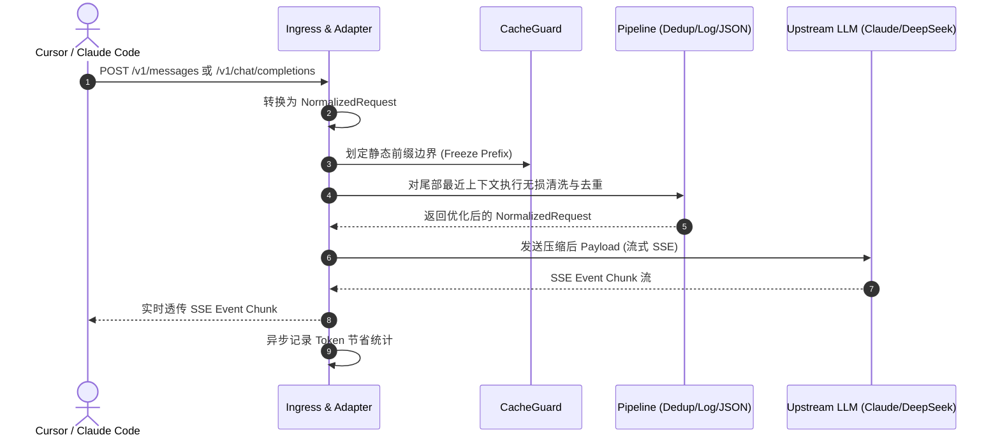

# CtxGuard 四阶段模块化详细开发文档

> **设计宗旨**：高内聚低耦合、单一职责（SRP）、零臃肿单文件（单文件代码量控制在 150~250 行以内）、面向接口扩展（Open-Closed Principle）。

---

## 目录
1. [整体工程模块化架构与目录规范](#一-整体工程模块化架构与目录规范)
2. [核心接口与抽象协议设计（扩展基石）](#二-核心接口与抽象协议设计扩展基石)
3. [第一阶段：MVP 核心网关与纯规则压缩 (Phase 1)](#三-第一阶段mvp-核心网关与纯规则压缩-phase-1)
4. [第二阶段：可逆展开、自适应调度与监控看板 (Phase 2)](#四-第二阶段可逆展开自适应调度与监控看板-phase-2)
5. [第三阶段：离线自进化引擎与规则落盘 (Phase 3)](#五-第三阶段离线自进化引擎与规则落盘-phase-3)
6. [第四阶段：ONNX 深度剪枝与基准评测 (Phase 4)](#六-第四阶段onnx-深度剪枝与基准评测-phase-4)
7. [开发者扩展指南（如何扩展新功能）](#七-开发者扩展指南如何扩展新功能)

---

## 一、 整体工程模块化架构与目录规范

为彻底避免单文件代码堆叠，整个项目划分为 **8 个顶级功能包**，所有功能均以细粒度子模块实现：

```text
ctxguard/
├── ctxguard/
│   ├── __init__.py
│   ├── config/                     # 【配置子系统】
│   │   ├── __init__.py
│   │   ├── schema.py               # Pydantic/Dataclass 配置模型定义
│   │   ├── loader.py               # YAML / ENV / 默认值合并加载器
│   │   └── validator.py            # 配置合法性校验
│   ├── proxy/                      # 【代理子系统】
│   │   ├── __init__.py
│   │   ├── server.py               # FastAPI/Starlette 实例装配与生命周期管理
│   │   ├── router.py               # 路由分发 (/v1/chat/completions, /v1/messages)
│   │   ├── upstream.py             # HTTPX 连接池与上游转发客户端
│   │   ├── sse.py                  # SSE 流式解析、事件重组与透传
│   │   └── adapters/               # 协议双向适配器
│   │       ├── __init__.py
│   │       ├── base.py             # 协议适配器抽象基类
│   │       ├── openai.py           # OpenAI 协议归一化与反向转换
│   │       └── anthropic.py        # Anthropic 协议归一化与反向转换
│   ├── core/                       # 【核心压缩与流水线引擎】
│   │   ├── __init__.py
│   │   ├── context.py              # NormalizedRequest / Response 上下文数据结构
│   │   ├── pipeline.py             # 压缩管道编排器与 Hooks 调度
│   │   ├── compressors/            # 各独立细粒度压缩算子
│   │   │   ├── __init__.py
│   │   │   ├── base.py             # 压缩器统一抽象基类 (BaseCompressor)
│   │   │   ├── dedup.py            # SHA-256 会话指纹去重器
│   │   │   ├── ansi_cleaner.py     # ANSI 颜色与光标终端控制码剥离
│   │   │   ├── progress_merger.py  # 进度条合并算子
│   │   │   ├── stacktrace.py       # 异常重复堆栈折叠算子
│   │   │   ├── json_struct.py      # JSON 数组同构提取与表格化折叠
│   │   │   └── whitespace.py       # 无效空行与空白符紧凑化
│   │   └── guards/                 # 缓存与安全守护器
│   │       ├── __init__.py
│   │       ├── cache_guard.py      # Prompt Cache 静态前缀冻结守护
│   │       └── ephemeral_tagger.py # Anthropic 缓存标记自动注入器
│   ├── storage/                    # 【单文件轻量持久化子系统】
│   │   ├── __init__.py
│   │   ├── schema.sql              # SQLite 数据库表结构定义
│   │   ├── db.py                   # SQLite 连接池与 WAL 模式管理
│   │   ├── repository_stats.py     # Token 统计与请求日志仓储
│   │   └── repository_fingerprint.py # 指纹内容持久化仓储
│   ├── learn/                      # 【离线自进化与规则落盘子系统】
│   │   ├── __init__.py
│   │   ├── loop_detector.py        # 报错与重复工具调用死循环检测
│   │   ├── causality_extractor.py  # 失败到成功因果转折点经验提取
│   │   ├── rule_renderer.py        # 规则 Markdown 模板生成
│   │   └── atomic_writer.py        # 隔离标记块幂等原子文件写入器
│   ├── plugins/                    # 【可选深度剪枝与插件子系统】
│   │   ├── __init__.py
│   │   ├── base.py                 # 插件接口定义
│   │   └── onnx/                   # ONNX INT8 剪枝实现
│   │       ├── __init__.py
│   │       ├── model_loader.py     # ONNX Runtime 模型懒加载
│   │       ├── tokenizer.py        # 极简纯词表 Tokenizer
│   │       └── scorer.py           # Token 分类重要度打分剪枝
│   ├── cli/                        # 【CLI 命令行子系统】
│   │   ├── __init__.py
│   │   ├── main.py                 # CLI 入口分发 (基于 argparse / click)
│   │   ├── cmd_start.py            # ctxguard start 子命令
│   │   ├── cmd_stats.py            # ctxguard stats 子命令（Rich 终端面板）
│   │   ├── cmd_learn.py            # ctxguard learn 子命令
│   │   └── cmd_config.py           # ctxguard config 校验与生成
│   └── utils/                      # 【基础工具集】
│       ├── __init__.py
│       ├── hasher.py               # 高性能 SHA-256 与快速指纹计算
│       ├── token_counter.py        # 启发式极速 Token 计数器
│       └── console.py              # Rich 终端高亮输出封装
├── tests/                          # 【单元测试与集成测试】
│   ├── unit/
│   │   ├── test_dedup.py
│   │   ├── test_json_struct.py
│   │   ├── test_log_cleaner.py
│   │   ├── test_cache_guard.py
│   │   └── test_config.py
│   └── integration/
│       ├── test_openai_proxy.py
│       └── test_anthropic_proxy.py
├── benchmarks/                     # 【基准评测套件】
│   ├── run_benchmark.py
│   └── datasets/
├── ctxguard.yaml.example           # 用户开箱即用配置文件模板
├── pyproject.toml
├── DESIGN.md
├── README.md
└── DEVELOPMENT_PLAN.md
```

---

## 二、 核心接口与抽象协议设计（扩展基石）

为了保证所有模块相互解耦，核心子系统依赖于以下轻量抽象接口：

### 1. 统一请求上下文模型（`ctxguard/core/context.py`）
```python
from dataclasses import dataclass, field
from typing import Any, Dict, List, Optional

@dataclass
class Message:
    role: str                       # "system" | "user" | "assistant" | "tool"
    content: Any                    # str | List[Dict[str, Any]] (多模态或带缓存标记)
    name: Optional[str] = None
    tool_call_id: Optional[str] = None
    metadata: Dict[str, Any] = field(default_factory=dict)

@dataclass
class NormalizedRequest:
    protocol: str                   # "openai" | "anthropic"
    model: str
    messages: List[Message]
    tools: Optional[List[Dict[str, Any]]] = None
    stream: bool = True
    temperature: Optional[float] = None
    raw_payload: Dict[str, Any] = field(default_factory=dict)
    session_id: str = ""
```

### 2. 压缩算子统一接口（`ctxguard/core/compressors/base.py`）
```python
from abc import ABC, abstractmethod
from ctxguard.core.context import NormalizedRequest

class BaseCompressor(ABC):
    @property
    @abstractmethod
    def name(self) -> str:
        """压缩算子唯一名称"""
        pass

    @abstractmethod
    def is_applicable(self, request: NormalizedRequest) -> bool:
        """根据请求特征判断当前算子是否应当激活"""
        pass

    @abstractmethod
    async def compress(self, request: NormalizedRequest) -> NormalizedRequest:
        """执行具体的无损/有损清洗逻辑，返回优化后的请求"""
        pass
```

### 3. 协议适配器统一接口（`ctxguard/proxy/adapters/base.py`）
```python
from abc import ABC, abstractmethod
from typing import Any, Dict
from ctxguard.core.context import NormalizedRequest

class BaseAdapter(ABC):
    @abstractmethod
    def to_normalized(self, raw_body: Dict[str, Any]) -> NormalizedRequest:
        """将客户端原始 JSON 转换为内部统一请求对象"""
        pass

    @abstractmethod
    def from_normalized(self, norm_req: NormalizedRequest) -> Dict[str, Any]:
        """将内部统一请求对象还原为发往上游的合法 JSON"""
        pass
```

---

## 三、 第一阶段：MVP 核心网关与纯规则压缩 (Phase 1)

* **周期**：第 1 ~ 2 周
* **目标**：实现透明反向代理，打通 OpenAI/Anthropic 双协议流式转发，提供全套纯算法无损压缩算子，保证 Prompt Cache 命中，开销削减 40%~60%。

### 1. 详细开发模块划分

| 模块文件 | 负责类/函数 | 详细职责与实现细节 |
| :--- | :--- | :--- |
| `ctxguard/config/schema.py` | `AppConfig`, `ServerConfig` 等 | 定义强类型配置结构，包含端口、超时、去重阈值、排除正则等。 |
| `ctxguard/config/loader.py` | `ConfigLoader.load_config()` | 按照 `CLI > ENV > ./ctxguard.yaml > ~/.ctxguard/ > Default` 顺序合并加载配置。 |
| `ctxguard/proxy/adapters/openai.py` | `OpenAIAdapter` | 转换 `/v1/chat/completions` 请求；提取 System、User、Assistant、Tool 返回值。 |
| `ctxguard/proxy/adapters/anthropic.py` | `AnthropicAdapter` | 转换 `/v1/messages` 请求；处理 top-level system 字段与 Content Blocks 嵌套结构。 |
| `ctxguard/proxy/upstream.py` | `UpstreamClient` | 管理 `httpx.AsyncClient` 连接池；添加 API Key 鉴权头部；实现异步流式转发与重试。 |
| `ctxguard/proxy/sse.py` | `SSEStreamHandler` | 拦截上游 SSE chunk 流；无感透传至客户端；异步统计输入/输出 Token 数量。 |
| `ctxguard/proxy/server.py` | `create_app()` | 组装 FastAPI 实例；注册中间件（CORS、耗时监控、全局异常处理）。 |
| `ctxguard/core/compressors/dedup.py` | `DedupCompressor` | 针对 Tool Result 与长文本计算 `SHA-256`；维护内存 LRU 指纹字典；二次出现替换为 `[Ref:sha256_... \| 350 lines unchanged]`。 |
| `ctxguard/core/compressors/ansi_cleaner.py` | `ANSICleaner` | 高性能正则 `\x1b\[[0-9;]*[a-zA-Z]` 清洗 ANSI 颜色与终端控制符。 |
| `ctxguard/core/compressors/progress_merger.py` | `ProgressMerger` | 识别多帧构建进度条（如 `npm`、`cargo`、`docker` 下载），仅保留最终一帧。 |
| `ctxguard/core/compressors/stacktrace.py` | `StacktraceFolder` | 计算连续多行异常堆栈的相似度；重复出现 $\ge 3$ 次折叠为 `[Repeated N times]`。 |
| `ctxguard/core/compressors/json_struct.py` | `JSONStructCompressor` | 检测由同构 Dict 组成的 JSON 数组；提取公共 Key 生成 `{"_schema": [...], "_rows": [...]}`。 |
| `ctxguard/core/guards/cache_guard.py` | `CacheGuard` | 冻结 System Prompt 与前 $N$ 轮历史消息，禁止压缩算子修改前缀字节，守护官方 Prompt Cache。 |
| `ctxguard/core/pipeline.py` | `CompressionPipeline` | 串联所有 Compressor 算子；在 `CacheGuard` 划定的允许修改区间安全执行压缩。 |
| `ctxguard/cli/cmd_start.py` | `run_server()` | 解析 CLI 参数，初始化配置，启动 uvicorn 实例。 |

### 2. 核心数据流转时序


---

## 四、 第二阶段：可逆展开、自适应调度与监控看板 (Phase 2)

* **周期**：第 3 ~ 4 周
* **目标**：实现 `ctx_expand` 虚拟工具的本地零消耗拦截，提供自适应多档位动态调度，接入 SQLite 单文件存储，提供 `ctxguard stats` 富文本看板。

### 1. 详细开发模块划分

| 模块文件 | 负责类/函数 | 详细职责与实现细节 |
| :--- | :--- | :--- |
| `ctxguard/core/virtual_tools/injector.py` | `VirtualToolInjector` | 在向模型发送请求前，自动注入虚拟工具元数据 `ctx_expand(ref_id: str)`。 |
| `ctxguard/core/virtual_tools/executor.py` | `VirtualToolExecutor` | 拦截客户端发来的 `tool_use: ctx_expand` 请求；直接从 SQLite/内存反查原始代码并返回，**阻断上游转发**，实现 0 Token 消耗秒级展开。 |
| `ctxguard/storage/schema.sql` | SQL DDL | 定义 `sessions`（会话表）、`requests`（请求指标表）、`fingerprints`（指纹内容表）。 |
| `ctxguard/storage/db.py` | `DatabaseManager` | 初始化本地 `.ctxguard.db`；开启 `PRAGMA journal_mode=WAL;` 与 `PRAGMA synchronous=NORMAL;`，保障毫秒级并发读写。 |
| `ctxguard/storage/repository_stats.py` | `StatsRepository` | 提供增删改查：记录请求耗时、压缩前 Token、压缩后 Token、节省比例。 |
| `ctxguard/core/adaptive_scheduler.py` | `AdaptiveScheduler` | 根据请求总 Token 动态决策压缩策略：$<16k$ 仅基础清洗，$\ge 16k$ 深度结构折叠。 |
| `ctxguard/cli/cmd_stats.py` | `show_stats()` | 使用 `Rich.Table` 与 `Rich.Panel` 展示精美看板：累计节省 Token、美元节省估算、近 24h 压缩率曲线。 |

---

## 五、 第三阶段：离线自进化引擎与规则落盘 (Phase 3)

* **周期**：第 5 周
* **目标**：实现 Headroom 模式离线自进化，从历史失败日志中识别死循环与重复报错，自动提炼经验并幂等写入 `.cursorrules` / `CLAUDE.local.md`。

### 1. 详细开发模块划分

| 模块文件 | 负责类/函数 | 详细职责与实现细节 |
| :--- | :--- | :--- |
| `ctxguard/learn/loop_detector.py` | `LoopDetector` | 分析 SQLite 历史轨迹：检测连续 $\ge 3$ 次调用相同工具失败、频繁读取同一不存在文件等死循环模式。 |
| `ctxguard/learn/causality_extractor.py` | `CausalityExtractor` | 提取“从反复报错到最终通过修改成功”的关键转折点；生成行动反思（如：“不要使用绝对路径，请使用相对路径”）。 |
| `ctxguard/learn/rule_renderer.py` | `RuleRenderer` | 将提炼出的经验渲染为 Markdown 规约条目。 |
| `ctxguard/learn/atomic_writer.py` | `AtomicRuleWriter` | 扫描目标文件（如 `CLAUDE.local.md`）；定位 `<!-- CTXGUARD_AUTO_RULES:START -->` 标记块；幂等、原子替换区块内容，不破坏用户原手写规则。 |
| `ctxguard/cli/cmd_learn.py` | `run_learn()` | 提供 `ctxguard learn` 命令行；支持 `--dry-run` 预览与 `--target` 指定输出文件。 |

---

## 六、 第四阶段：ONNX 深度剪枝与基准评测 (Phase 4)

* **周期**：第 6 周
* **目标**：针对超长上下文（>64k）提供轻量 ONNX INT8 文本剪枝插件（~30MB），构建自动化 Benchmark 评测套件，验证压缩比与代码生成质量，完成打包发布。

### 1. 详细开发模块划分

| 模块文件 | 负责类/函数 | 详细职责与实现细节 |
| :--- | :--- | :--- |
| `ctxguard/plugins/onnx/model_loader.py` | `ONNXModelLoader` | 懒加载轻量 INT8 ONNX 编码器模型（基于 `onnxruntime-cpu`，零 PyTorch 依赖）。 |
| `ctxguard/plugins/onnx/tokenizer.py` | `FastTokenizer` | 极简分词与 Token ID 映射。 |
| `ctxguard/plugins/onnx/scorer.py` | `ONNXTokenScorer` | 对输入文本的每个 Token 计算重要度二分类概率；结合保留率剔除无意义停用词，受保护关键词（`protected_keywords`）强制保留。 |
| `benchmarks/run_benchmark.py` | `BenchmarkRunner` | 自动化评测：在 GSM8K、HumanEval 和长上下文代码场景上测试无压缩 vs CtxGuard 压缩的 Token 节省率、耗时与 Pass@1 精度。 |
| `pyproject.toml` | Build Metadata | 完善包打包配置、依赖约束与入口命令，准备发布至 PyPI。 |

---

## 七、 开发者扩展指南（如何扩展新功能）

CtxGuard 的模块化架构支持开发者以极低代码量扩展新功能：

### 1. 新增自定义压缩算子（示例：代码注释精简器）
只需在 `ctxguard/core/compressors/` 下新建文件并继承 `BaseCompressor`：

```python
# ctxguard/core/compressors/comment_cleaner.py
import re
from ctxguard.core.compressors.base import BaseCompressor
from ctxguard.core.context import NormalizedRequest

class CodeCommentCleaner(BaseCompressor):
    @property
    def name(self) -> str:
        return "code_comment_cleaner"

    def is_applicable(self, request: NormalizedRequest) -> bool:
        return True

    async def compress(self, request: NormalizedRequest) -> NormalizedRequest:
        # 仅针对最后几条消息进行清洗
        for msg in request.messages[-2:]:
            if isinstance(msg.content, str):
                # 剥离无意义行注释，保留 docstring
                msg.content = re.sub(r'^\s*//.*$', '', msg.content, flags=re.MULTILINE)
        return request
```

### 2. 注册并生效
在 `ctxguard/core/pipeline.py` 中直接将新算子 append 到流水线中即可，无需修改其他任何模块。
