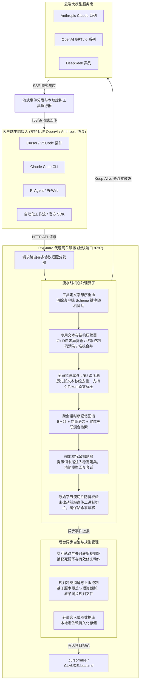

# 🛡️ CtxGuard

<div align="center">

**高并发、低延迟的 AI Agent 上下文治理与智能缓存加速网关**

*毫秒级算子流水线 • 保证云端 KV Cache 稳定命中 • 长效时序记忆 • 零业务侵入*

[](LICENSE)
[](https://www.python.org/downloads/)
[]()
[](https://fastapi.tiangolo.com)

</div>

---

## 📖 项目简介

在现代 AI Agent（如 Claude Code、Cursor、Pi Agent）的复杂编码与长链路自动化任务中，随着工具调用的频繁执行，请求上下文呈现指数级膨胀：大段未修改的代码差异、冗长的构建日志和重复堆栈迅速消耗宝贵的上下文窗口，并产生高昂的 Token 费用；与此同时，客户端工具定义的无序序列化与动态提示词拼接极易引发服务商前缀缓存（Prompt Cache）频繁失效。

**CtxGuard** 是一套部署在客户端与大模型服务商（OpenAI、Anthropic、DeepSeek 等）之间的透明反向代理网关。它在协议中转层对出向请求实施轻量级结构化优化与字节级防抖，在完全不损耗模型推理能力与代码逻辑的前提下，显著降低通信负载与计算开销，并为多轮会话提供自动进化的项目级经验沉淀与知识图谱记忆能力。

---

## 🖥️ 控制面板预览 (Web Dashboard)

CtxGuard 提供了现代化的一体化监控控制台（默认访问 `http://127.0.0.1:8787/dashboard`），用于直观监控全局 Token 流向、会话压缩曲线、知识图谱与自动演进的规则库：

| 实时 Token 流量趋势与多轮压缩监控 | 跨 Agent 时序知识图谱拓扑 |
| :---: | :---: |
|  |  |

| 控制面板全局数据大盘概览 | 自进化避坑经验规则库 |
| :---: | :---: |
|  |  |

---

## 🏛️ 系统架构



---

## 💡 核心设计与技术实现

### 1. 物理级前缀防抖与缓存保活
- **二进制切片透传**：对多轮对话中未发生变更的历史消息，跳过 Python 运行时的反序列化与字典重构，直接提取并转发原始 HTTP 请求的底层二进制切片，从根本上杜绝空格、换行符及浮点格式漂移。
- **Schema 确定性重构**：在网关层递归遍历 `tools` 列表及内部 JSON Schema 定义，统一按字母序进行确定性重排序，彻底解决各类客户端实现中字典无序导致的前缀缓存击穿。
- **生命周期冷热隔离**：将上下文划分为静态系统区与动态交互区。会话建立后自动锁定头部提示词快照，动态注入项仅追加于末尾活跃窗口，保证长对话全生命周期的前缀哈希绝对稳定。

### 2. 面向开发场景的专用结构压缩算子
- **统一差异格式（Unified Diff）智能折叠**：自动解析 Git 补丁语法，完整保留修改行与定位锚点，将大段无修改的上下文行替换为引用标记，支持在需要时无损还原。
- **终端交互乱码与进度条合并**：正则过滤 ANSI 转义字符与终端颜色控制码；对包管理工具及构建流水线连续打印的百分比进度条进行帧合并，仅保留最终完成状态。
- **异常堆栈模式折叠**：自动识别多轮重试过程中连续出现的同源 Traceback 堆栈，保留首次发生时的完整上下文并折叠后续重复信息。

### 3. 可逆内容指纹池与零开销还原
- **持久化块级哈希池**：提取请求中超过阈值的长文本块计算 SHA-256 指纹并存入轻量数据库，跨轮次或跨会话再次出现相同内容时自动替换为轻量占位标记。
- **LRU 动态容量自平衡**：根据文本访问频次与时间戳执行最近最少使用淘汰，确保本地缓存体积恒定可控。
- **本地虚拟工具拦截**：向客户端透明暴露解压接口，当模型发出展开请求时，由网关在本地毫秒级读取并返回原始内容，无需向上游发起二次计费网络请求。

### 4. 时序知识图谱与上下文混合召回
- **多模态语义检索**：结合 BM25 词频统计、稠密向量嵌入以及图谱实体关联进行三路加权打分，精准召回与当前任务相关的环境事实及开发偏好。
- **动态尾部安全注入**：将匹配到的背景知识以紧凑格式附加于当前轮次用户提问尾部，既保证模型即时感知上下文，又杜绝污染历史前缀缓存。
- **中文自然语言理解增强**：针对中文开发者的常用习惯短语与口语化偏好进行分词与谓词识别，过滤无效疑问句与停用词。

### 5. 失败模式自主学习与规则生命周期治理
- **转折点（Pivot）因果归因**：后台异步扫描交互轨迹，定位“工具连续报错 ➜ 调整参数 ➜ 执行成功”的关键行为序列，自动提取路径修正与环境运行规范。
- **规则去重与容量硬上限**：对同类触发条件的旧规则执行自动版本替换，并设立严格的数量上限（默认 10 条），淘汰低频规则以防止规则库过度膨胀。
- **原子标记区域同步**：通过专用的注释边界标记，将提炼后的最佳实践以原子覆盖方式写入项目配置文件，绝不覆盖用户手动编写的配置内容。

### 6. 输出端 Token 抑制与思考预算动态调度
- **响应风格确定性引导**：在请求末尾追加字节稳定的格式约定，指导大模型精简无意义的寒暄、前置铺垫以及对上下文已有代码的重复打印。
- **交互状态感知降级**：通过状态机区分机械操作轮次（如文件内容回传）与复杂逻辑分析轮次，在过渡阶段适度下调思考开销，进一步降低响应延迟与生成成本。

---

## 🚀 快速上手

### 环境准备与安装

```bash
# 克隆工程
git clone https://github.com/255308153/CtxGuard.git
cd CtxGuard

# 本地安装
pip install -e .
```

### 1. 启动本地网关

```bash
# 启动代理服务（默认监听 127.0.0.1:8787）
ctxguard start --port 8787
```

服务启动后，可在浏览器中打开 Web 监控看板：`http://127.0.0.1:8787/dashboard` 查看实时请求流量、Token 压缩曲线与图谱状态。

---

### 2. 客户端生态接入

#### 方式一：Wrap 一键直接拉起 Agent（最推荐，零配置）
```bash
# 自动在后台启动网关、自动感知原有中转地址并直接进入 Agent 终端：
ctxguard wrap claude        # 一键启动 Claude Code
ctxguard wrap pi            # 一键启动 Pi Agent
ctxguard wrap aider         # 一键启动 Aider
```
> **💡 Wrap 运行原理与底层工作流**：
> 1. **网关自愈探测**：自动检测 `8787` 端口是否存活，若未启动则毫秒级在后台自动静默拉起 Proxy 网关。
> 2. **上游配置自动感知 (Auto-Discovery)**：自动读取 `~/.claude/settings.json` 或 Pi 等配置文件中原本保存的真实中转站 API 地址与 Key，并在网关中建立专用映射。
> 3. **进程级隔离注入 (Isolated Spawning)**：在内存中为即将拉起的 Agent 子进程独立注入 `ANTHROPIC_BASE_URL` / `OPENAI_BASE_URL`，**完全不污染操作系统的全局环境**。
> 4. **原生 TTY 终端接管**：无缝透传 stdin/stdout 交互，退出 Agent 时自动完成状态清理与复盘。

#### 方式二：终端 Shell 快速注入（当前终端全自动生效）
```bash
# 自动设置当前终端会话的环境变量
eval $(ctxguard env --eval)

# 启动你的 Agent 即可自动享受代理加速：
claude
pi
```

#### 方式三：全自动客户端配置桥接（Cursor / Claude / Pi）
```bash
# 自动读取并记忆各客户端原有中转与 Key，自动将客户端 Base URL 改写指向代理网关
ctxguard env --patch
```

#### 方式四：手动配置服务端点
在任意兼容 OpenAI 或 Anthropic 协议的工具中配置代理地址：
- **OpenAI 兼容端点 (GPT / DeepSeek)**：`http://127.0.0.1:8787/v1`
- **Anthropic 兼容端点 (Claude Code)**：`http://127.0.0.1:8787`

---

## 📈 基准测试与生产实测数据

### 1. 标准基准测试 (Synthetic Benchmarks)

在标准受控测试集下的细分场景评测数据：

| 评测场景与优化维度 | 原始 Token 量 | 优化后 Token 量 | 节省比例 | 处理延迟 (p50) |
| :--- | :--- | :--- | :--- | :--- |
| **Git Diff 补丁上下文折叠** | 383 | 197 | **48.56%** | `0.15 ms` |
| **历史大文件重复引用** | 4,200 | 45 | **98.92%** | `0.08 ms` |
| **构建日志与终端控制码** | 1,850 | 320 | **82.70%** | `0.12 ms` |
| **多轮端到端 Coding 轨迹** | 6,735 | 5,584 | **17.09%** | `0.21 ms` |
| **模型输出端精简与塑造** | 1,240 (Output) | 860 (Output) | **30.70%** | `0.00 ms` |

### 2. 真实生产环境实测累计表现 (Production Real-World Stats)

基于本地 `.ctxguard.db` 记录的日常多 Agent 真实写代码会话累计数据：

| 核心统计指标 | 真实生产环境统计值 | 说明 |
| :--- | :--- | :--- |
| **拦截处理请求总量** | **2,499 次** | 涵盖日常编码、代码审查、单元测试等真实 Agent 轨迹 |
| **原始输入 Token 总量** | **480,922,262 Tokens** (~4.8 亿) | 未经网关优化的原始请求上下文体积 |
| **优化后输入 Token 量** | **123,253,252 Tokens** (~1.2 亿) | 经指纹去重、Diff折叠与日志清洗后的实际入参 |
| **累计净节省 Token** | **357,674,148 Tokens** (~3.57 亿) | 实际削减的纯有效上下文体积 |
| **综合上下文压缩率** | **74.37%** | **平均每 1 亿 Token 上下文可压降 7,400 万+** |
| **主流前沿模型实测** | **GPT / Claude / Gemini / DeepSeek** | 实测各主流旗舰模型均保持 **58% ~ 88%** 稳定压缩率 |

---

## 🛠️ CLI 命令速查

```bash
ctxguard wrap <agent>     # 自动感知中转配置并直接一键拉起目标 Agent (claude/pi/aider)
ctxguard env --patch      # 自动扫描并改写本地客户端配置指向代理网关
ctxguard stats            # 查看网关当前的吞吐量、压缩效率与近期待处理请求
ctxguard savings          # 查看长周期的 Token 与成本节约明细
ctxguard learn --apply    # 手动触发历史轨迹复盘并更新项目规则
ctxguard env              # 查看或导出各客户端的环境变量配置
```

---

## 📄 开源许可证

本项目基于 [MIT License](LICENSE) 许可证开源发布。
