# 🛡️ CtxGuard

<div align="center">

**面向大模型与 AI Agent 的超轻量、零侵入上下文治理与长效记忆网关**

*削减 50%~80% Token 开销 • 守护云端 Prompt Cache 100% 命中 • 零代码改造 • 亚毫秒级延迟*

[](LICENSE)
[](https://www.python.org/downloads/)
[]()
[](https://fastapi.tiangolo.com)

</div>

---

## ⚡ 什么是 CtxGuard？

**CtxGuard** 是一款专为长对话 Coding Agent（如 Claude Code、Pi Agent、Cursor、VSCode）及大模型应用设计的超轻量反向代理与**请求侧上下文治理安全网关**。

它以透明代理方式部署在开发者本地，介于 Agent 客户端与大模型服务商（Anthropic、OpenAI、DeepSeek）之间。通过实时拦截出向 API 请求，在**不修改任何客户端业务代码、不影响大模型推理精度**的前提下，实现工具冗余输出压缩、Prompt Cache 前缀物理防抖、时序偏好记忆安全召回、失败经验自进化提炼及模型输出端降噪。

---

## 🏛️ 系统架构图

```mermaid
flowchart TD
    subgraph ClientLayer["1. 客户端生态层 (零代码侵入)"]
        A1["Cursor / VSCode"] 
        A2["Claude Code"] 
        A3["Pi Agent / Pi-Web"]
        A4["OpenAI / 官方 SDK"]
    end

    ClientLayer -->|HTTP POST /v1/chat 或 /v1/messages| GatewayIngress

    subgraph CtxGuardGateway["2. CtxGuard 上下文治理网关 (监听 8787 端口)"]
        GatewayIngress["网关统一入口 & 多协议智能路由器"]

        subgraph IngressPipeline["请求侧优化核心流水线"]
            direction TB
            P1["工具与Schema归一化 (ToolsNormalizer)<br/>深度递归字母序重排，阻断键序抖动"]
            P2["结构化专用压缩算子矩阵<br/>GitDiff折叠 / ANSI清洗 / 重复堆栈合并 / AST修剪"]
            P3["内容指纹库与LRU容量淘汰 (FingerprintPool)<br/>长文本去重，支持 0-Token 虚拟解压"]
            P4["时序知识图谱记忆引擎 (MemoryGraphEngine)<br/>BM25+向量+图谱三路混合检索，User尾部安全注入"]
            P5["输出端Token塑造器 (OutputShaper)<br/>冗余客套修剪 & 机械轮次思考预算动态降级"]
            P6["原始字节切片防抖门禁 (RawByteOverlayGuard)<br/>未修改前缀直传二进制切片，保证 0-Drift"]
            
            P1 --> P2 --> P3 --> P4 --> P5 --> P6
        end

        GatewayIngress --> IngressPipeline

        subgraph BackgroundEngines["后台异步自进化与持久化引擎"]
            B1["死循环扫描与失败转折分析 (LoopDetector & PivotAnalyzer)<br/>从错误到成功的因果经验自动提炼"]
            B2["规则剪枝与原子覆盖 (RulePruner & AtomicWriter)<br/>同源冲突覆盖，10条预算硬截断，原子写入规则文件"]
            B3["内嵌 SQLite 图谱库与指纹缓存池<br/>零维护本地持久化"]
        end

        IngressPipeline -.->|异步日志与事件流| BackgroundEngines
        BackgroundEngines -.->|原子更新| C1[".cursorrules / CLAUDE.local.md"]
    end

    subgraph CloudProviders["3. 云端大模型服务商"]
        L1["Anthropic Claude 3.5 / 3.7"]
        L2["OpenAI GPT-4o / o1 / o3 / GPT-5"]
        L3["DeepSeek V3 / R1"]
    end

    IngressPipeline -->|高并发连接池 Keep-Alive / HTTP/2| CloudProviders
    CloudProviders -->|SSE 流式 Token| GatewayEgress["SSE 流式处理器 & 本地虚拟工具拦截器"]
    GatewayEgress -->|打字机流式回传| ClientLayer
```



---

## 🚀 六大核心特性

### 1. 🔒 Prompt Cache 物理级绝对防抖 (0 字节漂移保证)
- **会话前缀快照冻结 (Session Prefix Freeze)**：会话首部系统提示词与历史结构快照锁定，杜绝会话中途修改规则引起的缓存击穿。
- **Schema 递归归一化 (`ToolsNormalizer`)**：对 `tools[]` 列表及嵌套 JSON Schema 属性进行深度字典序重排，彻底消除客户端无序字典导致的缓存失效。
- **原始二进制切片直传 (`RawByteOverlayGuard`)**：针对未修改的冻结前缀跳过 Python 反序列化，直传原始 HTTP 二进制切片，确保头部 SHA-256 哈希绝对一致，稳定吃满云端 50%~90% KV Cache 缓存折扣。

### 2. 🗜️ 十级结构化专用压缩算子矩阵
- **Git Diff 上下文行折叠 (`GitDiffCompressor`)**：精准识别 Unified Diff 语法，严格保留修改行（`+`/`-`）与 Hunk 头部，自动折叠无变动的长上下文行（**单项节约 48.6% Token，耗时仅 0.15ms**）。
- **终端 ANSI 与进度条清洗**：正则擦除控制乱码，合并构建工具刷出的数十次进度条，仅保留 100% 最终完成帧。
- **异常堆栈折叠 (`StacktraceFolder`)**：自动合并循环死磕时连续打印的重复报错堆栈。
- **AST 代码骨架修剪**：大文件首次读取时自动修剪函数体，提取紧凑接口定义与函数签名。

### 3. 🔄 可逆去重与 0-Token 本地瞬时还原
- **内容指纹池 (`FingerprintRepository`)**：大文本按块哈希入库，引入访问频次与时间戳加权的 **LRU 自动容量淘汰**机制。
- **虚拟工具 `ctx_expand`**：历史重复文件替换为精简引用标记。当大模型需要查看完整细节时，网关在本地毫秒级拦截 `ctx_expand` 并还原原文，**消耗 0 上游 Token、产生 0 网络延迟**。

### 4. 🧠 时序知识图谱与三路混合记忆检索
- **三路混合召回**：结合 BM25 关键词精确匹配、稠密向量语义相似度及知识图谱关系推理，原生支持中文双字分词与四级作用域（USER / PROJECT / SESSION / TURN）。
- **缓存安全尾部注入**：召回的事实偏好严格追加在最新一轮用户提问末尾（微观热区），绝不破坏头部历史前缀缓存。
- **虚拟工具 `memory_save` & `memory_search`**：支持大模型在交互中主动调用标准工具记笔记，网关出口本地拦截落库。

### 5. 🛠️ 因果自进化与规则淘汰引擎
- **失败转折因果复盘 (`PivotAnalyzer`)**：自动寻找从报错失败到探索成功的关键转折点（Turning Point），自动提炼路径修正与环境命令规则。
- **规则预算硬截断 (`RulePruner`)**：自动覆盖同触发源的旧规则（Supersede），设定 10 条上限预算截断，防止规则库无限排队膨胀。
- **原子标记覆盖 (`AtomicRuleWriter`)**：以 `<!-- ctxguard:learn:start -->` 标准边界标记幂等重写 `.cursorrules` 和 `CLAUDE.local.md`，绝不覆盖开发者手写的全局配置。

### 6. ✂️ 输出端 Token 压缩与行为塑造
- **冗余套话动态修剪**：在提示词末尾注入字节稳定型控制哨兵，分级消除开场客套、结尾总结与已有代码的重复复述。
- **思考预算动态降级**：状态机自动识别机械轮次（如文件读取、测试通过）与复杂推理轮次，自适应降低机械轮次的思考强度，**实测输出侧 Token 净降 30.7%**。

---

## 📦 快速上手

### 源码安装

```bash
# 克隆仓库
git clone https://github.com/255308153/CtxGuard.git
cd CtxGuard

# 本地可编辑模式安装
pip install -e .
```

### 1. 启动网关服务

```bash
# 启动 CtxGuard 代理网关（默认端口 8787）
ctxguard start --port 8787
```

- **可视化控制面板**：浏览器访问 `http://127.0.0.1:8787/dashboard` 查看实时 Token 流量折线图与知识图谱。

---

### 2. 连接你的 Agent 客户端生态

#### 方式 A：终端 Shell 一键环境变量注入 (推荐 CLI Agent)
```bash
# 自动导出网关代理地址至当前终端
eval $(ctxguard env --eval)

# 直接启动你的主力 Agent（无缝接管）：
claude          # 启动 Claude Code
pi              # 启动 Pi Agent
```

#### 方式 B：全自动客户端配置扫描与补丁 (Cursor / VSCode)
```bash
# 自动扫描本地客户端配置，记忆原有中转站并一键桥接至网关
ctxguard env --patch
```

#### 方式 C：图形客户端手动填写 Base URL
在客户端设置中将 API Base 地址指向本地网关：
- **OpenAI 兼容协议 (GPT / DeepSeek)**：`http://127.0.0.1:8787/v1`
- **Anthropic 兼容协议 (Claude Code)**：`http://127.0.0.1:8787`

---

## 📊 性能与节省基准计分板

| 评测基准场景 | 原始 Token 消耗 | 优化后 Token 消耗 | Token 净节省率 | 压缩处理延迟 (p50) |
| :--- | :--- | :--- | :--- | :--- |
| **Git Diff 审查折叠** | 383 | 197 | **48.56%** | `0.15 ms` |
| **重复文件读取 (指纹去重)** | 4,200 | 45 | **98.92%** | `0.08 ms` |
| **终端构建与运行日志** | 1,850 | 320 | **82.70%** | `0.12 ms` |
| **10 轮真实 Agent 完整轨迹** | 6,735 | 5,584 | **17.09%** | `0.21 ms` |
| **输出端行为塑造** | 1,240 (输出) | 860 (输出) | **30.70%** | `0.00 ms` |

---

## 💻 常用 CLI 终端命令

```bash
ctxguard stats            # 查看实时 Token 优化指标与近期请求流水
ctxguard savings          # 查看长期累积财务省钱账本与进度条
ctxguard learn --apply    # 扫描历史失败轨迹，提炼并同步项目规则
ctxguard env              # 查看全生态 Agent 连接预设与环境命令
```

---

## 📄 开源许可证

本项目基于 [MIT License](LICENSE) 协议开源。
