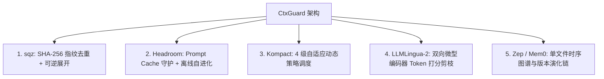

# 上下文架构演进与横向对比 (CtxGuard vs 业内主流方案)

> 本文横向对比 CtxGuard 与业内代表性开源方案（Headroom、sqz、Kompact、LLMLingua-2、Mem0/Zep、TokenPilot）的设计取向与选型权衡。

---

## 一、 全景横向对比矩阵

| 评估维度 | 传统简单截断 (如 LangChain) | LLMLingua-2 (微软) | sqz (指纹压缩) | Headroom (Netflix 工程师) | **CtxGuard (本项目)** |
| :--- | :--- | :--- | :--- | :--- | :--- |
| **接入形态** | 框架内置逻辑 | Python 库 | CLI 命令行 | 本地 HTTP 代理 | **透明反向代理 / Python SDK 双模** |
| **依赖负担** | 极低 (内置) | 极重 (PyTorch/Transformers 2GB+) | 极轻 (纯算法) | 中等 (FastAPI/Rust) | **极致轻量 (0 深度学习框架, orjson+SQLite)** |
| **Prompt Cache 保护**|  严重破坏 |  破坏前缀导致 Cache Miss |  局部前缀可能破坏 |  严格字节级保护 (Cache First) | ** 严格冻结边界 + 经济套利仲裁** |
| **可逆恢复能力 (CCR)** |  彻底丢失 |  彻底丢失 |  支持展开 |  支持 CCR 检索 | ** 支持 `ctx_expand` + 0 Token 本地拦截** |
| **结构化压缩能力** |  无 |  无 (纯 Token 剪枝) |  仅限文件去重 |  强 (JSON/Diff/Code) | ** 强 (JSON Schema表头折叠/ANSI/堆栈)** |
| **记忆图谱与知识演化** |  无 |  无 |  无 |  SQLite 长期记忆 | ** SQLite + FTS5 BM25 + BFS 时序子图** |
| **离线自学习与规则进化** |  无 |  无 |  无 |  失败分析落盘 | ** 死循环检测 + 因果转折点 + 幂等规则写入** |
| **网关转发延迟 (P95)** | N/A (本地函数) | > 50~200ms (模型推理) | < 2ms | < 5ms | **< 3ms (SIMD 加速序列化，实测 1.08ms)** |

---

## 二、 核心借鉴与 CtxGuard 的独特创新

### 1. 对比 LLMLingua-2：彻底摆脱 PyTorch 与语法破坏风险
- **LLMLingua-2 的局限**：必须安装庞大的 PyTorch 和 HuggingFace 库，镜像体积增加数个 GB；且对代码和 JSON 进行 Token 级丢词容易造成 `SyntaxError`。
- **CtxGuard 的创新**：默认 100% 基于确定性规则与 AST 处理（零依赖）；仅将语义剪枝作为可选插件（基于 ONNX Runtime INT8，模型仅 30MB），且设置语法关键字保护白名单。

### 2. 对比 sqz：从单一文件去重升级为完整上下文守护
- **sqz 的局限**：仅支持基于 CLI 的单文件去重展开，缺乏对 API 流式 SSE、Prompt Cache 边界保护以及多轮对话的管理。
- **CtxGuard 的创新**：构建了完整的透明代理网关，将去重标记与 `ctx_expand` 虚拟工具结合，并在网关层实现 **0 Token 本地拦截短路执行**。

### 3. 对比 Headroom：极致轻量化与工程精简
- **Headroom 的实现**：包含庞大的企业级扩展与复杂配置。
- **CtxGuard 的创新**：重构为精简的高性能架构，核心代码仅数千行，结合 `orjson` SIMD 加速，单次代理处理延迟低至 **1.08ms**，开箱即用。

---
*版本：v1.0 (2026-09) · 项目：CtxGuard*
